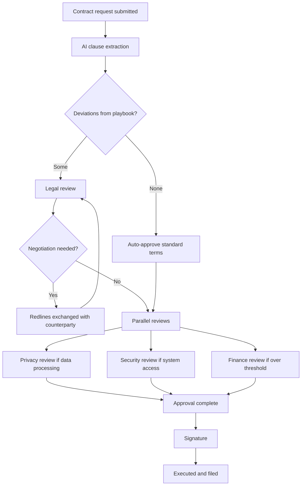

# Legal review and approval

A contract request builds a review chain the same way a purchase request builds an approval chain: from the data on the request, evaluated against your workflow. Legal is one reviewer among several, and for many low-risk agreements legal is not required at all.

## The path from request to signature

## Who gets pulled in

**Legal.** Added when the agreement is on supplier paper, when extraction finds deviations from your playbook, when the value crosses a threshold, or when the agreement type always requires it.

**Privacy.** Added when the vendor will process personal data. The reviewer checks the data processing terms, the transfer mechanism, and the subprocessor list.

**Security.** Added when the vendor will hold company data or connect to internal systems. Security's review of the contract runs alongside the vendor risk assessment rather than duplicating it.

**Finance.** Added on value, on non-standard payment terms, or on any commitment that spans multiple fiscal years.

**Business owner.** Confirms the commercial terms match what was negotiated. Easy to skip and frequently the reason a wrong number reaches signature.

## Standard-terms auto-approval

When extraction finds no deviation from your playbook and the request stays under the relevant thresholds, the legal step can auto-approve. The contract still gets a legal reviewer of record, and the auto-approval is logged with the rule that fired and the extraction result it relied on.


Auto-approval is worth configuring narrowly at first, usually for a single template and a single agreement type, and widening it once you have seen a quarter of results. The risk is not that it approves something wrong, it is that the playbook is out of date.


## Negotiation rounds

When the counterparty returns redlines, upload the new version to the contract record. Zip compares it against the previous version and against your playbook, and shows what moved. Reviewers who already approved are re-engaged only for the sections that changed.

Every version is retained. The record shows who sent what and when, which matters when someone asks six months later why a particular clause reads the way it does.

## Signature

Once approvals are complete, the contract routes for signature through your e-signature provider. Zip tracks signature status and files the executed copy on the contract record automatically. Countersignature by the counterparty is tracked as well, so a contract sitting unsigned on their side is visible rather than assumed complete.

An executed contract moves to **Active** and its obligations and renewal dates begin tracking. See [Obligations and renewals](../repository/obligations-and-renewals.md).
