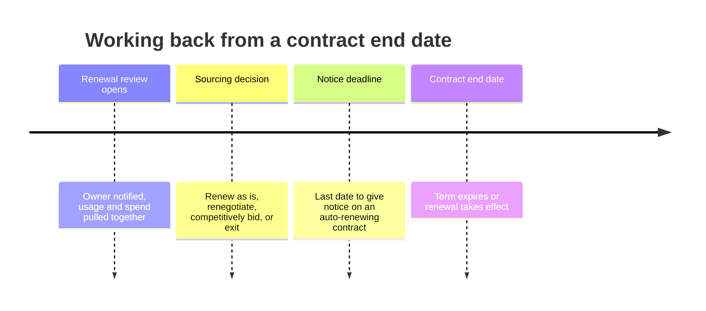

# Obligations and renewals

An executed contract creates two kinds of ongoing work: things you have to do, and dates you have to act on. Both are extracted at signature and tracked for the life of the agreement.

## Obligations

An obligation is a commitment written into the contract that someone has to fulfill. Extraction proposes them, and a reviewer confirms the list at execution.

Typical obligations include a minimum spend commitment, a volume tier that must be reached, a required insurance certificate the vendor must maintain, a security certification renewed annually, an audit right exercised within a window, and a notice one party must give before a change.

Each obligation has an owner, a due date or a recurrence, and a status. Owners are notified ahead of the due date and record completion with evidence where evidence is required.


Obligations on your side are the ones that get missed. A vendor will remind you that you owe them a purchase commitment. Nobody reminds you that you were supposed to serve notice before exercising a benchmarking right.


## Renewal types

**Fixed term.** The agreement ends on the end date and needs a new contract to continue. Low risk, high administrative load.

**Auto-renewal.** The agreement renews automatically unless notice is given within the notice period. This is where money is lost, because the deadline to act is not the end date, it is the end date minus the notice period.

**Renewal by agreement.** The parties may extend but neither is obliged to. Effectively a fixed term with an easier path to continuing.

## The renewal timeline

Zip calculates the notice deadline from the extracted end date and notice period, and opens a renewal task ahead of it. Lead time is configurable and should be set by category: a strategic platform needs months, a low-value tool needs weeks.

## Working a renewal

The renewal task carries the context needed to decide: current price, spend against the contract, the obligations either side did or did not meet, any risk findings raised during the term, and the business owner's assessment.

From the task the owner chooses to renew on existing terms, renegotiate, put the category out to competition through [Sourcing](https://app.gitbook.com/s/yWPKTXf10NGJgEVmE6Ok/), or exit and give notice. Each choice starts the corresponding workflow with the contract already linked.

## Escalations and reporting

An approaching notice deadline with no decision escalates, first to the owner's manager and then to the category owner. Deadlines that pass without action are reported rather than silently closed, because an unwanted auto-renewal is worth understanding even after it happens.

The renewal calendar shows everything expiring in a window by value, category, and owner. Reviewing it at the start of each quarter is the single most effective habit for avoiding surprise renewals.
