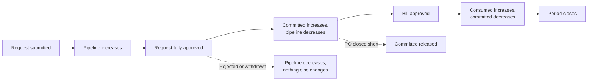

# How budgets work

A budget in Zip is an amount, for a period, attached to a set of dimensions. Against that amount, Zip tracks three running numbers.

## The three numbers

**Committed** is the value of requests that are approved but not yet billed. It is the forward view: money your organization has agreed to spend but has not yet paid.

**Consumed** is the value of bills that have been approved against the budget. It approximates the actual in the ERP, subject to timing.

**Remaining** is the budget amount less committed less consumed. This is the number a requester sees before they submit.

Pending requests, still in approval, are shown separately as pipeline. They do not reduce remaining, because most organizations do not want a request in draft to block a colleague's approved purchase.

## When each number moves

Two behaviors are worth understanding.

**Commitment releases when a PO closes short.** If a PO for an annual amount is closed after being partially billed, the unbilled remainder returns to the budget rather than staying committed forever.

**Change orders adjust in place.** Increasing a PO increases the commitment against the same budget, and can trigger a fresh budget check.

## Relationship to the ERP

Zip's budget view and the ERP's are answering different questions. The ERP knows what has posted. Zip knows what has posted plus what has been committed and is on its way.

For that reason, Zip's consumed figure will not tie exactly to the ledger at any given moment. Bills approved but not yet posted, and accruals booked directly in the ERP, both create differences. This is expected. Zip's number is for decision-making during the period; the ERP's is for reporting after it.


If your finance team needs the two to reconcile, agree a cutoff and reconcile at period end rather than daily. The common reconciling items are timing on bill posting, journals booked outside Zip, and spend on categories that have no budget mapped.


## What is in scope

By default, budgets track spend that flows through Zip: purchase requests, purchase orders, and bills. Spend that never enters Zip, such as payroll or intercompany allocations, is not tracked and should not have a budget defined in Zip.

Vendor card spend is tracked where the card transaction is linked back to a request.

## Multi-currency

A budget is denominated in the currency of its subsidiary. Line items in another currency are converted using the rate configured for your organization, and the converted amount is what consumes the budget. The original amount stays on the record.

Next, see [Create a budget](create-a-budget.md).
