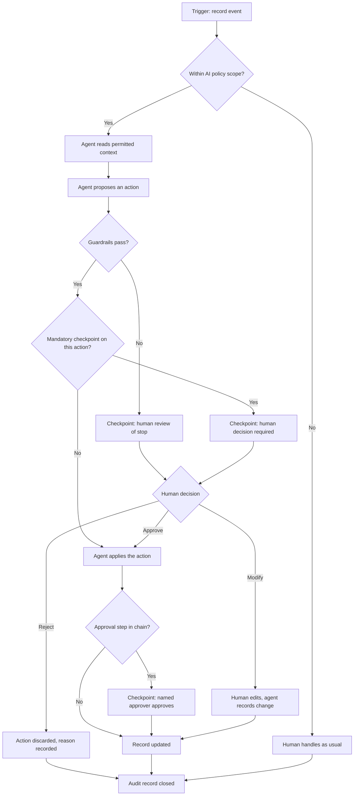

# Human checkpoints

A checkpoint is a point where the process stops until a person decides. Checkpoints are set in policy and enforced by the platform, so an agent cannot pass one regardless of how it is configured.

## Where checkpoints sit

Three distinct things stop an agent, and it is worth keeping them separate when you design a process.

**A guardrail stop** is the agent's own limit: a threshold, a confidence floor, a variance tolerance. Configurable per agent.

**A mandatory checkpoint** is a policy rule that this class of action always needs a person, however confident the agent is. Configurable per policy, not per agent.

**An approval step** is part of your approval chain and applies whether or not AI was involved. Built in the [workflow engine](https://app.gitbook.com/s/cCva0sBd9z7KRG56Fq0I/).

## Checkpoints Zip always enforces

These cannot be removed by configuration.

* Approving spend. Approval is always recorded against a person.
* Changing vendor bank details or payment instructions.
* Releasing a payment or a payment run.
* Awarding a sourcing event.
* Executing a contract or accepting non-standard legal terms.
* Overriding a failed risk assessment.

## Adding your own checkpoints

Add checkpoints in the AI policy for anything your organization treats as a judgment call. Common additions are first transactions with a new vendor, any spend in a regulated category, cross-border engagements, and anything above a value your finance leadership names.


Write checkpoints as decisions rather than as record types. "Any commitment to a vendor with no prior contract" survives a process redesign. "Any PR on form 12" does not.


## What the reviewer sees

At a checkpoint, the reviewer gets the proposed action, the records and policy sections the agent used, the guardrails evaluated, and what the agent was uncertain about. They can approve, modify, or reject with a reason. All three outcomes are recorded, and rejections with reasons are the most useful input to [evaluation](../assurance/evaluation-and-drift.md).


Watch for reviewers approving every checkpoint within seconds. A checkpoint that is never exercised is not a control, and it is the pattern an auditor will find. If a checkpoint is genuinely unnecessary, remove it deliberately rather than letting it decay.

