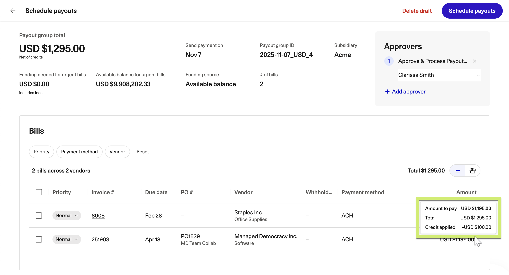

# Payment status and remittance

Once your invoice is approved it becomes a bill, and the bill is scheduled into a payout. You can follow both stages in the vendor portal.

<figure></figure>

## Payment statuses

| Status | Meaning |
| ------ | ------- |
| Submitted | Your invoice has been received, not yet coded |
| In approval | Coded and moving through your customer's approvers |
| Approved | Cleared for payment, awaiting scheduling |
| Scheduled | Included in a payout with a send date |
| Paid | Payment issued |
| Returned | Sent back to you with a reason |

## When you will be paid

Payment date is driven by your agreed payment terms and your customer's payment run schedule. A bill approved just after a payment run typically waits for the next one.

Multiple bills to you may be combined into a single payment. When that happens you receive one payment covering several invoices, and the remittance advice lists each one.


If a vendor credit has been applied, the payment is net of that credit. The remittance advice shows the gross amount, the credit applied and the net paid.


## Remittance advice

Zip sends remittance notification automatically when payment is issued. It goes to your remittance email address if you have supplied one, and otherwise to your contacts on file.

Keep your remittance email current under **Company profile**, then **Contacts** in the portal.

## Chasing a payment

1. Check the status in the portal first, since most questions are answered there
2. If the bill is **In approval**, your customer's approvers still hold it
3. If the bill is **Scheduled**, the send date is shown and no action is needed
4. If the invoice does not appear at all, it was not received. Resubmit it


Never act on an email asking you to change the bank account a customer pays you into, even if it appears to come from them. Contact your customer on a number you already hold.


## Related articles

* [Submitting an invoice](submitting-an-invoice.md)
* [Updating your banking details](https://app.gitbook.com/s/6BeW2bup2FUvVioEI5Le/company-profile/updating-banking-details)
* [Payments in the product documentation](https://app.gitbook.com/s/uvWZCHh4l0VWI5nRG3c4/vendor-payments/scheduling-payments)
