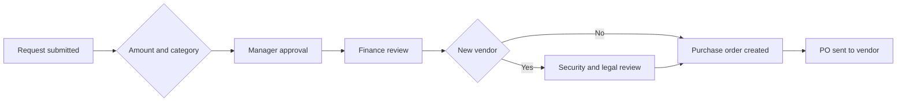

# Creating a purchase request

A purchase request is how every purchase starts in Zip. You describe what you want to buy and Zip routes it to the right approvers based on the amount, the category and the vendor.

## Before you start

Have the following ready:

* A quote, order form or pricing page from the vendor
* The department and cost center the spend belongs to
* Your best estimate of the annual amount, including any usage-based components

## Submitting a request



## Start a new request

Select **New request** from the Zip home page. Choose the intake form that matches what you are buying, for example software, professional services, or hardware.



## Describe the purchase

Fill in the vendor, the amount, the currency and a short business justification. Zip shows additional fields as you go, based on your answers.



## Attach supporting documents

Upload the quote or order form. Attaching the document up front is the single biggest factor in how fast a request clears approvals.



## Review and submit

Check the summary, then select **Submit**. Zip generates the approval chain and notifies the first approver.



## What happens next

Approvals run in the order Zip determines from your organization's policy. Some steps run in parallel, so a request can sit with security and legal at the same time.

## Tracking your request

Open **My requests** to see where the request is and who currently holds it. Zip notifies you by email, and in Slack or Teams if your organization has that integration enabled.


If a request has been sitting with the same approver for a while, use the **Nudge** action on the request rather than emailing separately. The nudge is recorded on the request timeline.


## Common reasons a request is sent back

* The attached quote does not match the amount entered
* The department or cost center is missing
* The vendor is new and has not completed onboarding
* The purchase duplicates an existing agreement

What if I have already bought the thing?

Submit the request anyway and note the date of purchase in the justification. Zip supports retroactive requests, but finance will usually want to understand why the process was bypassed, and repeated retroactive requests may trigger a policy review.

## Related articles

* [Purchase order details](purchase-order-details.md)
* [Approving a bill](approving-a-bill.md)
* [Intake-to-Procure documentation](https://app.gitbook.com/s/BMSPlYB6zBpUu9WDNW3q/)
