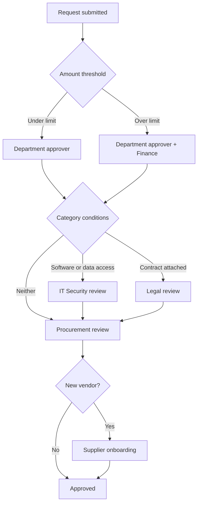

# Approval routing THIS IS NEW!!

THIS IS NEW !!!! Zip builds an approval chain for each request at submission time by evaluating your workflow against the request's data. Nobody selects approvers by hand, and requesters never need to know policy. If the data changes, the chain is rebuilt.

## How a chain is assembled

Each condition adds a step or leaves it out. The chain is the set of steps whose conditions matched, ordered by the sequence defined in the workflow.

## Condition inputs

Conditions read three sources.

**Request fields.** Amount, currency, category and subcategory, department, cost center, GL code, subsidiary, and any answer to a form question.

**Vendor attributes.** Whether the vendor is new, its onboarding state, its risk tier, and whether it has an active contract.

**Requester attributes.** Department, entity, and reporting line, which is how manager chains are resolved.

## Step types

**Individual approver.** One named person. Use sparingly, because it creates a single point of failure.

**Group approver.** Any member of a group can act. This is the common case for finance, legal, and security queues.

**Dynamic approver.** Resolved from data at run time, for example the requester's manager, the owner of the selected cost center, or the category owner for the selected subcategory.

**Manager chain.** Walks up the reporting line until it reaches an approver whose authority limit covers the amount.

## Parallel and sequential steps

Steps in the same stage run in parallel. Legal and security can review at the same time rather than queuing behind each other. Stages run in sequence, so a request does not reach the final finance approval until every earlier stage is complete.


Parallel steps shorten cycle time but can surprise approvers who expect to see a fully reviewed request. If a stakeholder needs to see security's verdict before deciding, put them in a later stage rather than the same one.


## Skips, delegation, and auto-approval

An approver can delegate to a named delegate for a date range. Delegated approvals record both people.

A step can be configured to auto-approve when a condition is met, for example a renewal under a threshold with no change in terms. Auto-approvals are logged in the activity feed with the rule that fired, so they remain auditable.

An administrator can skip a step. Skips require a reason and are always visible on the request.

## Testing a workflow

Use the workflow simulator to submit a hypothetical request and see the chain it produces without notifying anyone. Test the boundaries of every threshold, not the middle. For workflow construction, versioning, and testing, see [Workflow Engine](https://app.gitbook.com/o/6WfIzfI8ygNrqaIpvHah/s/cCva0sBd9z7KRG56Fq0I/).
