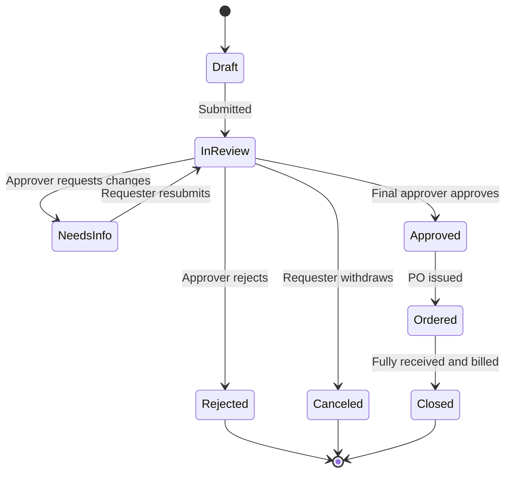

# Request statuses

Every purchase request in Zip carries a status. The status answers one question: what has to happen next, and who has to do it. Statuses are set by Zip as the request moves through its workflow, not chosen by hand.

## The status lifecycle

## What each status means

**Draft.** The requester has started a request but has not submitted it. No one else can see it and no approvals have been triggered.

**In review.** The request is moving through its approval chain. One or more approvers are assigned at any given time. The request detail page shows the current step and who is holding it.

**Needs info.** An approver sent the request back to the requester with a question or a change. Approvals are paused. When the requester resubmits, the chain resumes at the step that sent it back, and earlier approvals are preserved unless the edit changed a field that routing depends on.

**Approved.** Every required approver has approved. The request is cleared to buy. Depending on your configuration, Zip either creates a purchase order automatically or waits for a buyer to issue one.

**Rejected.** An approver declined the request. Rejected requests are terminal. To pursue the purchase, the requester raises a new request, usually referencing the rejected one.

**Canceled.** The requester or an administrator withdrew the request before it was approved.

**Ordered.** A purchase order has been issued against the approved request. From here the record continues into receiving and invoicing.

**Closed.** No further activity is expected. The PO has been fully received and billed, or a buyer closed it manually.


Editing an approved request does not silently keep its approvals. If you change the amount, vendor, category, or any other field that routing conditions read, Zip re-evaluates the chain and returns the request to **In review** for the approvers the new values require.


## Statuses and reporting

Status is one of the main filters on the **Requests** page and in reporting. Cycle time is measured between status changes, so a request sitting in **Needs info** for a week counts against the requester rather than against an approver. Procurement teams commonly track time in **In review** by approval step to find the stage that slows requests down.

For how these statuses feed spend reporting and savings, see [Spend Insights](https://app.gitbook.com/s/zebllmmpY7BlosLYBwUh/).
