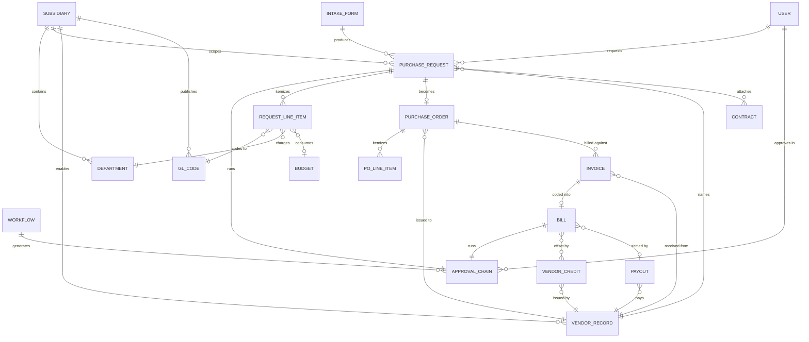

# Core objects

Almost everything in Zip is one of a small number of objects. Learning what each one is, and which object it points at, explains most of the product's behavior.

## The object model

## The objects, one by one

Transaction objects

**Purchase request (PR)**: what a requester submits. It carries the intake form answers, one or more line items, the named vendor, and the approval chain. It is the root of the audit trail for a purchase.

**Purchase order (PO)**: the commitment issued to the vendor. Zip can generate it automatically when a PR is fully approved, populated from the PR, and sync it to the ERP. A PO tracks how much of its value has been billed.

**Invoice**: the document the vendor sends. It reaches Zip by email, vendor portal upload, or manual creation, and Zip scans it to pre-populate the record. Invoices match to POs where possible.

**Bill**: the coded, approvable form of an invoice. Coding assigns GL codes, departments, tax codes, and amortization schedules. Once coded, the bill runs its own approval chain.

**Payout**: the payment issued to the vendor, net of any applied vendor credits. One payout can settle several bills for the same vendor and currency.

**Vendor credit**: a credit memo from the vendor, matched to a PO and applied to bills before payment.

Master data objects

**Vendor record**: the supplier as Zip knows it, including contacts, banking details, onboarding state, and risk status. Vendor records are enabled per subsidiary.

**Subsidiary**: the legal entity a transaction belongs to. Subsidiary determines the currency, the available chart of accounts, and often the approval policy.

**Department, GL code, cost center**: the accounting dimensions applied to line items, normally synced from the ERP.

**Category and subcategory**: Zip's own taxonomy for what is being bought. Categories drive routing far more often than GL codes do.

Process objects

**Intake form**: the questions asked at the start. See [Intake management](https://app.gitbook.com/s/klfPYPbO77zxOWiQGk7y/).

**Workflow**: the rules that decide who approves what. See [Workflow engine](https://app.gitbook.com/s/cCva0sBd9z7KRG56Fq0I/).

**Approval chain**: the instantiated result of a workflow on one record. Chains exist on requests and on bills, and are the thing an approver actually acts on.


The link from a payout back to the original purchase request survives the whole chain. Open a payout, follow it to the bill, the invoice, the PO, and the PR, and you can see the intake answers and every approval that authorized the spend.

