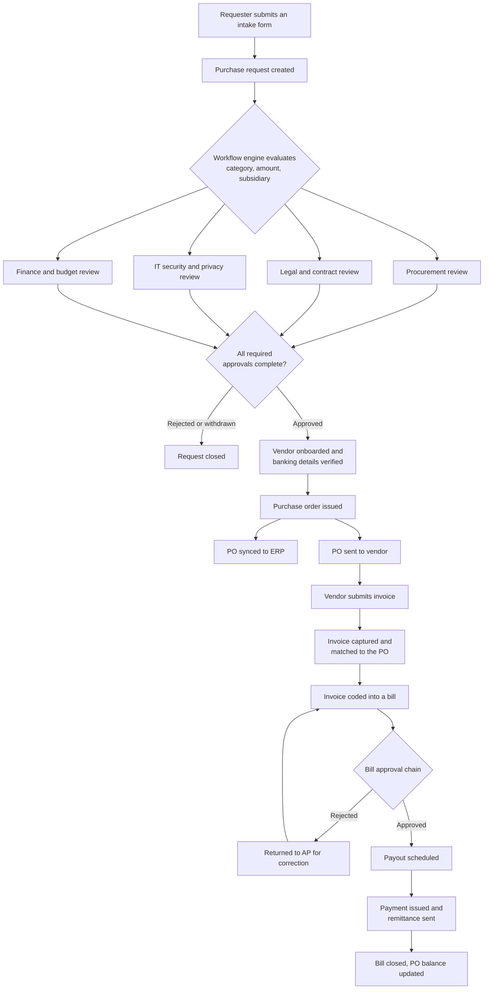

# The procurement lifecycle

Every purchase in Zip follows the same spine. Individual organizations add or remove reviews, but the sequence of objects does not change: a request becomes a purchase order, the purchase order collects invoices, invoices become bills, and bills are settled by payouts.

## End to end

## Where each stage lives

**Intake and approval** is covered in [Intake-to-Procure](https://app.gitbook.com/s/BMSPlYB6zBpUu9WDNW3q/). The request is the system of record for why the purchase was authorized.

**Vendor readiness** runs in parallel with approval in most configurations. Onboarding, banking verification, and risk assessment are handled in [Supplier Onboarding](https://app.gitbook.com/s/QStVF3i0EZksxOR4LHvB/) and [Risk Orchestration](https://app.gitbook.com/s/yP3apwhDPTBLUNkrxs0C/), so a vendor is payable by the time the PO issues.

**PO through payout** is covered in [Procure-to-Pay](https://app.gitbook.com/s/uvWZCHh4l0VWI5nRG3c4/).

## Things worth knowing about the flow

The branches after intake are genuinely parallel. Legal does not wait for security, and neither waits for finance, unless your workflow explicitly makes a step dependent on an earlier one.

Not every request produces a purchase order. Requests for things that are already contracted, or that are handled on a vendor card, can complete without a PO. The request record still holds the approval history.

An invoice can arrive before anyone expects it. Zip captures it, matches it to an open PO, and holds it for coding rather than rejecting it. If no PO matches, the invoice sits in the inbox as an exception for AP to resolve.


A purchase order that has not synced to the ERP is not yet a commitment your finance team can see. Check the sync status on the PO before telling a vendor to begin work.


## Re-entry points

The lifecycle is not strictly one-directional. Change orders reopen a PO and can require re-approval. Vendor credits reduce what a bill settles for. A renewal typically starts a new request that references the prior one, so the history compounds rather than resets.
