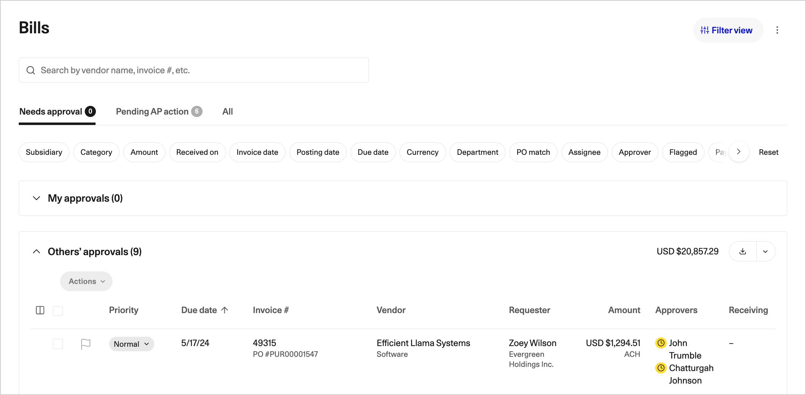

# Reviewing and approving bills

A bill is a coded invoice waiting to be paid. Approval is the last point at which a person confirms that the goods or services were received, the coding is right, and the money should go out.

## How approvers are assigned

Zip assigns bill approvers automatically once a bill is fully coded. Assignment is dynamic: it reads the bill and applies your organization's policy, rather than routing everything to a fixed list.

Rules commonly read:

* Amount, against the thresholds your policy sets
* Subsidiary and department
* Category and subcategory
* Vendor, and whether the vendor is flagged for extra scrutiny
* Whether a PO matched, and whether the match raised an exception
* The GL accounts the bill was coded to

Because the rules read coded values, recoding a bill can change who has to approve it. Zip re-evaluates the chain when a value the rules depend on changes, so a bill recoded to a different department goes to that department's approver rather than the original one.

Approval chains are built in the same [workflow engine](https://app.gitbook.com/s/dxaoa7neP0H4mhCCMRFl/) as request approvals, with the same support for sequential steps, parallel steps, and conditional branches.


Anyone with sufficient permissions can see the status of any bill and who is currently assigned to it, without being an approver themselves. Chasing an approval does not require an administrator.


## The Bills page

<figure></figure>

The **Bills** page is the working queue. Three tabs split it by who has to act.

| Tab | What it holds | Who works it |
| --- | --- | --- |
| **Needs approval** | Bills sitting with an approver. Split into **My approvals** and **Others' approvals**, each with a count and a total. | Approvers work **My approvals**. AP watches **Others' approvals** to see what is stuck and with whom. |
| **Pending AP action** | Bills that need something from Accounts Payable: coding to finish, a match exception to clear, a rejected bill to fix, a failed ERP sync to retry. | Accounts Payable. |
| **All** | Every bill regardless of state, including paid and rejected. | Anyone researching a specific bill or vendor. |

Search by vendor name or invoice number, and narrow with the filter chips: **Subsidiary**, **Category**, **Amount**, **Received on**, **Invoice date**, **Posting date**, **Due date**, **Currency**, **Department**, **PO match**, **Assignee**, **Approver**, **Flagged**, and payment method. **Reset** clears them all. Use **Filter view** to save a combination you return to, for example your subsidiary's bills due this week.

The queue columns show **Priority**, **Due date**, **Invoice #** with the PO number beneath it, **Vendor**, **Requester**, **Amount** with the payment method, **Approvers** with their current state, and **Receiving**. Sort by due date to work the bills that will actually go late.

Select several bills and use **Actions** to approve or reassign them together. Batch approval is appropriate for a run of low value, cleanly matched bills. It is not appropriate for anything carrying a match exception.

## Reviewing a bill



## Open the bill from your queue

The bill opens with the source invoice document beside the coded fields, so you are reviewing the coding against the actual document rather than against a summary.



## Check the PO match

The **PO Match** tab shows the matched PO, the amount billed against it, and the remaining balance. Confirm the bill is billing against the PO you would expect, and that the remaining balance still makes sense after this bill. Any match exception is shown here, not hidden.



## Confirm receipt

Where receiving applies, check that the goods or services were receipted. For services, this is often the requester confirming the work was done. Do not approve on the assumption that someone else checked.



## Check the coding

Department, category, GL account, tax code and any amortization schedule. You are approving the accounting treatment as well as the payment.



## Approve or reject

Approving moves the bill to the next step in the chain, or to **Ready for payment** if you are the last approver. Rejecting sends it back with your reason.



Comments on the bill are the right place for questions. They stay on the record, so the next person who looks at this vendor can see what was asked and answered.

## Approving

Approving is a statement that the bill is correct and payable. When the last approver in the chain approves, the bill becomes eligible for a payout group and appears under **Ready for payment** on the **Payments** page. It is not paid at that moment: it still has to be scheduled, and the payout still has to be approved. See [Scheduling payments](../vendor-payments/scheduling-payments.md).

Approval does not choose a pay date. Zip schedules against the due date and your payment terms, so approving early does not pay early.

## Rejecting

Rejecting returns the bill to Accounts Payable with your reason. It does not tell the vendor anything.

Reject when the problem is on your side and can be fixed: wrong coding, wrong PO, wrong subsidiary, missing receipt, an amount that does not reconcile. AP corrects the bill and resubmits it, and Zip re-evaluates the approval chain against the corrected values.


If the fault is the vendor's, the fix is not a rejection. Ask AP to [return the invoice to the vendor](../invoices/coding-and-matching.md) so the vendor knows to reissue. A rejected bill is invisible to the vendor, who will keep waiting and then chase for payment.


Always write a reason. A rejection with no explanation comes straight back to you unchanged.

## Notifications

Zip notifies approvers when a bill reaches them, by email and in Slack or Teams depending on what your organization has connected.

* The notification names the vendor, the amount and the due date, and links straight to the bill.
* In Slack and Teams, approvers can approve or reject from the message for straightforward bills. Anything with an exception opens in Zip.
* Reminders escalate as the due date approaches, so a bill about to go late is chased harder than one with three weeks on it.
* Approvers get a digest rather than one message per bill where volume is high.

## Delegation

Approvers who will be unavailable should set a delegate rather than letting bills queue.

* Set a delegate for a date range in your user settings. Bills routed to you during that period go to your delegate instead.
* Delegated approvals are recorded as approved by the delegate on your behalf. The audit trail names both people.
* Your policy decides who is eligible as a delegate, and may block delegation above a threshold or on specific categories.
* An administrator can reassign an individual bill without delegation, for example when an approver leaves. That reassignment is logged.

If nobody is delegated and a bill sits, the workflow's escalation rules take over and move it up the chain. See [escalation and delegation](https://app.gitbook.com/s/dxaoa7neP0H4mhCCMRFl/) for how escalation is configured.

Bills that need AP action rather than approval

**Pending AP action** collects bills that are not waiting on a person's judgment. Common cases:

* Coding was never finished, so no approval chain has been built.
* A match exception has to be cleared before the bill can move.
* An approver rejected the bill and it is waiting to be corrected.
* The ERP sync failed, usually because a coding value is inactive in the ERP.
* The vendor is not payable, for example onboarding is incomplete or bank details are unverified.

Work this tab daily. Bills here are silently accruing lateness while nobody has been asked to do anything about them.

