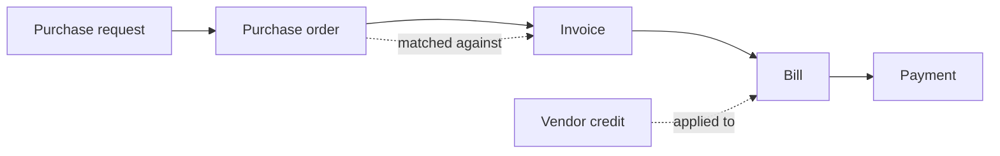
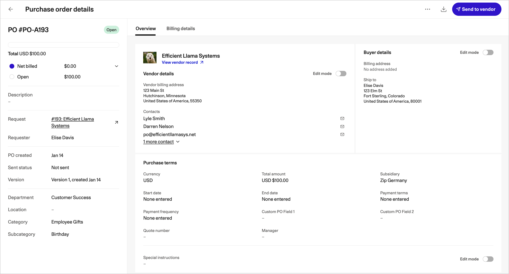

# What is the Payments Product?

The **Pay** module in Zip is designed to support vendor payment operations. In combination with Zip's [intake-to-procure](https://app.gitbook.com/s/BMSPlYB6zBpUu9WDNW3q/) features, the payments product provides a unified, end-to-end procurement and payment solution.

It includes the following features.

## Purchase Orders

When a purchase request (PR) is fully approved, Zip can automatically generate a PO populated with many of the details from the PR and sync it to your organization's external ERP solution where applicable.

<figure></figure>

Zip streamlines the process of sending branded POs to your vendors, and vendors can view and download POs directly from the [Zip vendor portal](https://app.gitbook.com/s/6BeW2bup2FUvVioEI5Le/), a one-stop solution for interacting with you, their customer.

Payment processing is linked to the POs being paid, with a clear connection back to the original purchase requests. Meanwhile, purchase order details make it easy to see how much of the PO amounts have been billed or offset by vendor credits.


Purchase Order management is also available as a separate add-on without purchasing the payments product. For more information, see [Using PO Management with Intake-to-Procure](https://app.gitbook.com/s/BMSPlYB6zBpUu9WDNW3q/purchase-orders/converting-a-request-to-a-po).


## Invoices

Vendor invoices can reach Zip in [many different ways](../invoices/how-invoices-reach-zip.md), including via email, via vendor portal uploads, or via manual creation on the **Inbox** page. When your organization receives an invoice from a vendor, Zip automatically scans the invoice document and creates an invoice record pre-populated with as many of the invoice details as possible.

<figure></figure>

Invoices are automatically matched to the correct POs wherever possible. Tax codes and amortization schedules are automatically retrieved from your organization's ERP system. All of this saves your Accounts Payable team time on the repetitive task of coding invoices. Zip automatically and dynamically assigns specific teams or team members to code invoices based on invoice details.

## Bills

Zip automatically assigns bill approvers to review and approve or reject bills once they have been fully coded. As with invoice coding, these assignments are dynamic based on measurements of bill criteria defined by your organization's policies.

Zip sends email and Teams or Slack notifications to approvers when it is their turn to approve bills. As with purchase requests, Zip provides transparency so anyone with sufficient permissions can check the status of a given bill at any time and see who is currently assigned to review and approve it.

<figure></figure>

## Vendor Payments

In addition to virtual cards, the **Pay** module makes it easy to schedule payments to vendors, enforce your organization's payout approval processes, and actually issue those payments. Multi-currency, multi-subsidiary payments can be scheduled in a single payments run.

You can make periodic wire transfers to fund clearing accounts in Zip, which are then used automatically when the pay date is reached for approved, scheduled payments. Alternatively, for bank accounts funded in US dollars, you can configure direct debits from your organization's bank account to pay for vendor payouts.

<figure></figure>

If your administrators enable it, multiple payments to the same vendor will automatically be combined into a single payment with only one transaction fee, saving your organization money.

When you issue payments to vendors via Zip, Zip automatically sends remittance notifications to the vendors. If the vendor has supplied a remittance email address, Zip sends a notification to that address. If not, Zip sends notifications to the vendor's first ten contacts.

## Vendor Credits

In case vendors issue credit memos to your organization, the **Pay** module features full support for integrating vendor credits into your payment process. Credits can be matched to POs and applied to coded bills with the same vendor and currency. When payment is issued for those bills, it will be net of credits, taking into account applied vendor credits.

<figure></figure>

## Where to go next

<table data-view="cards"><thead><tr><th></th><th></th><th data-hidden data-card-target data-type="content-ref"></th></tr></thead><tbody><tr><td><strong>Purchase orders</strong></td><td>Read the PO details page and learn how amendments work.</td><td><a href="../purchase-orders/purchase-order-details.md">purchase-order-details</a></td></tr><tr><td><strong>Invoices</strong></td><td>How invoices arrive, get scanned, matched and coded.</td><td><a href="../invoices/how-invoices-reach-zip.md">how-invoices-reach-zip</a></td></tr><tr><td><strong>Bills</strong></td><td>Approval assignment, review and rejection.</td><td><a href="../bills/reviewing-and-approving-bills.md">reviewing-and-approving-bills</a></td></tr><tr><td><strong>Vendor payments</strong></td><td>Scheduling payouts, funding and remittance.</td><td><a href="../vendor-payments/scheduling-payments.md">scheduling-payments</a></td></tr></tbody></table>
