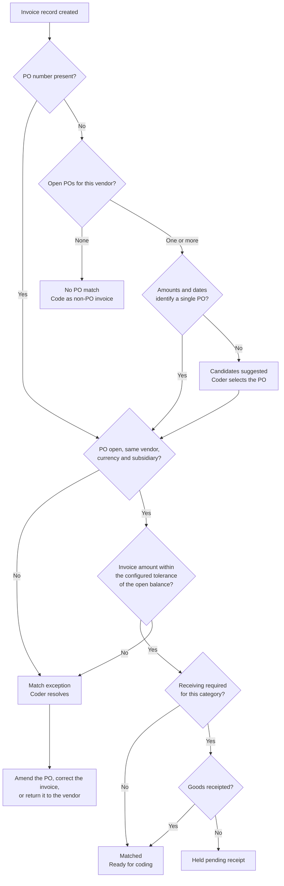

# Coding and PO matching

Coding is the work of turning a scanned invoice into a bill your ERP will accept: the right PO, the right GL coding, the right tax treatment, the right period. Zip does as much of it as the data allows and assigns the rest to whoever your policy says should do it.

## Automatic PO matching

Zip attempts to match every invoice to an open purchase order as soon as the invoice record is created. It looks at, in order of confidence:

* A PO number quoted on the invoice or supplied with a portal upload
* Open POs for the same vendor in the same currency and subsidiary
* Amounts, dates and line items against the remaining open balance on those POs

<figure></figure>

The match panel on the invoice shows the matched PO, who requested it, the remaining balance as a bar, and net billed against the PO total. **Other matched bills** expands the list of bills already billed against that PO, which is how you check whether an unexpected balance is legitimate.

The **PO Match** tab holds the full comparison, line by line where both documents have lines.

### The matching decision

Whether receiving is checked at all depends on your configuration. Organizations that receipt goods run a three-way match of PO, receipt and invoice. Organizations that do not run a two-way match of PO and invoice.

## Match tolerances and exceptions

A match rarely lands on the exact cent. Your administrator configures the tolerance Zip will accept, usually as a percentage, an absolute amount, or both, and often differently by category.

Within tolerance, the invoice matches and moves on. Outside tolerance, Zip raises a match exception and does not create a bill until someone resolves it.

| Exception | What it means | Usual resolution |
| --- | --- | --- |
| **Over-billing** | The invoice exceeds the remaining open balance by more than the tolerance. | Amend the PO upward if the extra spend is agreed, or return the invoice. |
| **Quantity variance** | Invoiced quantity does not match the PO or the receipt. | Confirm delivery with the requester, then correct the invoice or the receipt. |
| **Price variance** | Unit price differs from the PO line. | Check the quote number on the PO. Amend the PO if the price change was agreed. |
| **Currency mismatch** | The invoice currency differs from the PO currency. | Ask the vendor to reissue in the PO currency, or match to a PO in the invoice currency. |
| **No receipt** | Receiving is required for the category and nothing has been receipted. | Chase the requester to confirm receipt. Do not receipt on their behalf. |
| **Closed or cancelled PO** | The PO is no longer open to billing. | Reopen the PO, match to a different PO, or code the invoice as non-PO if your policy allows. |
| **Duplicate suspected** | The invoice resembles one already recorded on this vendor. | Compare the two records. Discard the duplicate or clear the flag. |


Do not resolve an over-billing by amending the PO to whatever the invoice says. The amendment goes back through approval precisely so that a person who owns the budget agrees to the increase. Amending to match the invoice defeats the control.


Invoices with no PO at all

Not every payable has a PO behind it. Utilities, taxes, rent, expense reimbursements and legacy contracts commonly arrive without one.

Zip codes these as non-PO invoices. There is no match to satisfy, so the coding fields carry the full weight of getting the accounting right, and approval routing relies on the coded values rather than on the PO. Your policy usually applies tighter approval thresholds to non-PO spend for exactly that reason.

If your organization is trying to raise PO coverage, the non-PO population is the number to watch. It is reported in [Spend Insights](https://app.gitbook.com/s/zebllmmpY7BlosLYBwUh/).

## Coding fields from the ERP

Zip does not maintain its own accounting configuration. Tax codes, GL accounts, departments, classes and amortization schedules are retrieved from your ERP and presented as the values that ERP will accept.

**Tax codes.** Zip pulls the tax code list for the subsidiary and applies the code the vendor and category imply, then calculates tax on the coded lines. Where the invoice states tax explicitly, Zip compares its calculation to the stated amount and flags a difference rather than silently overriding either.

**Amortization schedules.** For prepaid and term expenses, Zip retrieves the schedules configured in the ERP and applies one based on the PO start and end dates. A twelve month subscription invoiced up front picks up the schedule that spreads it across the coverage period, and the schedule syncs with the bill rather than being rebuilt in the ERP by hand.

**GL coding.** Category and subcategory on the PO map to GL accounts through the mapping your administrator maintains. Coders can override the derived account where their permissions allow, and the override is recorded.

Because these lists come from the ERP, a value that is missing in Zip is almost always missing or inactive in the ERP. See [ERP integration](https://app.gitbook.com/s/BMSPlYB6zBpUu9WDNW3q/purchase-orders/erp-integration).

## Dynamic assignment of coders

Zip assigns invoices to the team or the individual who should code them, based on the invoice itself rather than a fixed queue.

Assignment rules read the values Zip already has: subsidiary, vendor, category and subcategory, amount, whether a PO matched, and which entity the invoice belongs to. A software renewal for a European subsidiary can go to one AP specialist while a facilities invoice for a US site goes to another, without anyone triaging a shared inbox.

* Assignment happens on creation, and again if a value that the rules read changes.
* Assignees are notified by email and in Slack or Teams.
* The **Assignee** filter on the **Bills** page and the invoice queue shows what is on any given person's plate.
* Where a team is assigned rather than a person, any member can pick the invoice up, and the record shows who took it.

Rules are built in the [workflow engine](https://app.gitbook.com/s/dxaoa7neP0H4mhCCMRFl/), so coder assignment uses the same conditions and the same escalation behavior as approval routing.

## Returning an invoice to the vendor

Some invoices should not be coded at all. **Return to vendor** in the invoice header sends it back rather than parking it in the queue.

Return an invoice when:

* It bills for something never ordered, or for a PO that does not exist
* The vendor entity, subsidiary or bill-to is wrong
* It is a duplicate of an invoice already recorded
* The amounts or the tax treatment are wrong on the vendor's side
* It is not an invoice, for example a statement of account



## Select Return to vendor

The action sits in the invoice header, beside **Create bill**.



## Give the reason

Write what the vendor has to change. "Incorrect" gives the vendor nothing to act on and produces a second wrong invoice.



## Confirm

Zip notifies the vendor contacts, and portal vendors see the return and the reason against the invoice they uploaded.



A returned invoice is closed out on your side. It does not become a bill, it does not appear in approval queues, and it does not consume PO balance. If the vendor reissues, the corrected document arrives as a new invoice record.


Return the invoice rather than rejecting the bill where the fault is the vendor's. A rejected bill is an internal event the vendor never sees, so the vendor keeps waiting for a payment that is not coming.


Once coding is complete, select **Create bill**. From there the invoice becomes a bill and enters approval: see [Reviewing and approving bills](../bills/reviewing-and-approving-bills.md).
