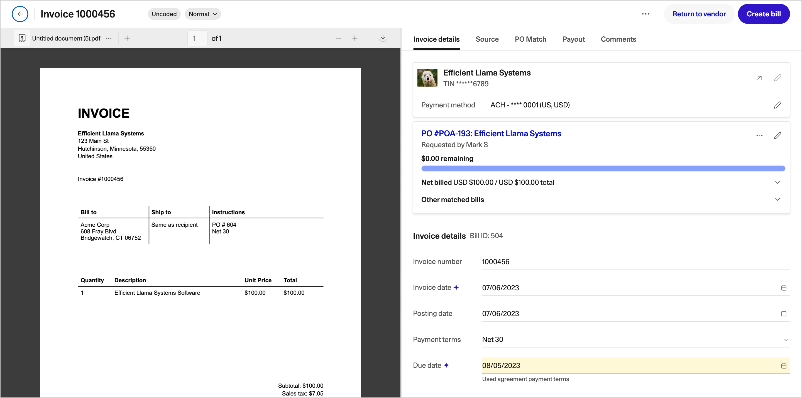
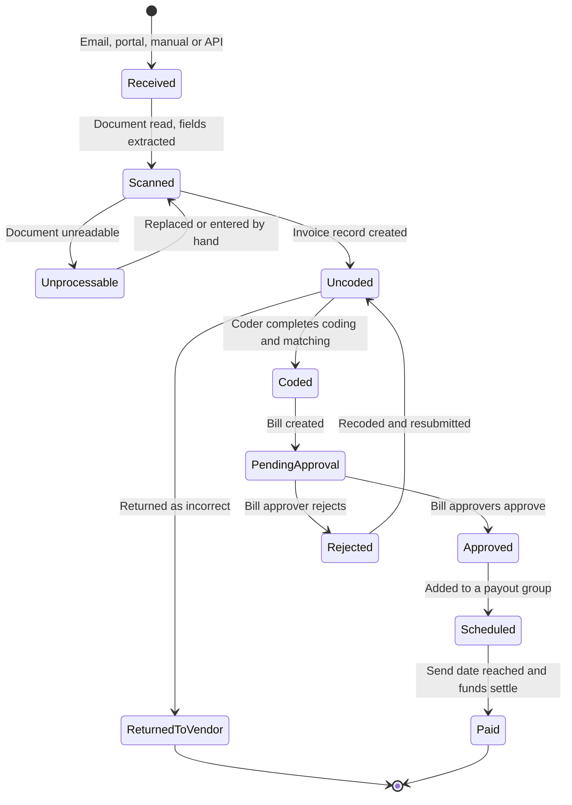

# How invoices reach Zip

Vendor invoices arrive in whatever way the vendor finds easiest, which is rarely the way you would choose. Zip accepts all of the common routes and treats them identically once the document is in: every invoice becomes an invoice record, and every invoice record is scanned.

## The ingestion routes

| Route | How it works | Best for |
| --- | --- | --- |
| **Email** | Vendors send invoices to a dedicated AP address that your administrator configures. Zip creates an invoice record from each attachment. | Vendors who are not onboarded to the portal, and existing invoice flows you do not want to disturb. |
| **Vendor portal upload** | The vendor uploads the invoice against a specific PO in the [vendor portal](https://app.gitbook.com/s/6BeW2bup2FUvVioEI5Le/). | Onboarded vendors. The PO reference comes across explicitly, so the match rarely fails. |
| **Manual creation** | An AP user creates the invoice on the **Inbox** page and attaches the document. | Paper invoices, invoices that reached someone's personal mailbox, and documents that failed to process on another route. |
| **API** | Your systems post invoices to Zip directly. | Bulk feeds, EDI relays, and organizations consolidating invoices from another AP tool. |

### Email

Each subsidiary or business unit can have its own intake address, which lets Zip set the subsidiary on arrival rather than asking a coder to work it out later. Publish the address on your PO template so vendors use it without being told.

Zip creates one invoice record per attachment, not one per email. An email with three PDFs produces three invoice records. The email body and sender are kept on the record so you can see who sent what.

Forwarded emails work. Zip reads the attachment, and the forwarding user is recorded as the person who brought it in.

### Vendor portal upload

Portal uploads are the cleanest route. The vendor selects the PO they are invoicing against, so the PO reference is structured data rather than something extracted from a page. Zip also shows the vendor the remaining open balance before they submit, which prevents a proportion of over-billings at source.

Getting vendors onto the portal is part of [Supplier Onboarding](https://app.gitbook.com/s/QStVF3i0EZksxOR4LHvB/).

### Manual creation on the Inbox page

The **Inbox** page is where AP works through invoices that have arrived but are not yet invoice records, and where you create one by hand.



## Open the Inbox page and choose to create an invoice

Select the vendor. If the vendor does not exist yet, raise it through vendor onboarding rather than creating a placeholder, or the invoice will not be payable.



## Attach the invoice document

Zip scans the attachment and pre-fills the fields it can read, exactly as it does for an emailed invoice.



## Check the extracted values against the document

The document sits alongside the fields so you can compare them without switching windows. Correct anything the scan misread.



## Save the invoice record

The invoice enters the normal flow: PO matching, coder assignment, and then bill creation.



### API

The invoices endpoint accepts an invoice payload with or without a document attached. Use it when another system is already the system of record for invoice receipt, or when a scanning bureau delivers structured output. See the [API reference](https://app.gitbook.com/s/CXK9J3Tjg4dEAgf0G90t/invoices/).

## Scanning and field extraction

Zip scans the invoice document on arrival and creates an invoice record pre-populated with as many details as it can read.

<figure></figure>

The invoice details page keeps the source document beside the extracted fields. Fields that Zip populated from the document are marked, so a reviewer can tell at a glance which values were read from the page and which were entered or inherited.

Zip extracts:

* Invoice number
* Invoice date and posting date
* Vendor identity, matched against your vendor records
* Currency and totals, including tax and any subtotal lines
* Payment terms, and the due date implied by them
* Any PO number quoted on the invoice
* Line items, where the document presents them in a readable table

Where the invoice states no payment terms, Zip falls back to the terms on the matched PO or the vendor agreement, and marks the due date to show where it came from. That is why a due date can be populated on an invoice that never mentioned one.


Extraction is a starting point, not an authority. The coder is responsible for the values on the record. Zip highlights inferred fields precisely so they get a second look.


## From invoice to payment

Every invoice takes the same path once it is in, regardless of the route it arrived on.

The invoice header carries the current stage as a chip, alongside the priority. **Uncoded** is the state most invoices sit in when they land on a coder's queue.

## When an invoice cannot be read

Some documents defeat scanning: a photograph taken at an angle, a password protected PDF, a statement of account with no invoice on it, a scan at too low a resolution, or a file type Zip does not process.

Zip does not discard these. It creates the record with whatever it could establish, usually the sender and the attachment, and surfaces it on the **Inbox** page for a person to handle.

Working through an unreadable invoice

**Check that it is an invoice.** Statements, dunning letters, order confirmations and marketing attachments all arrive at AP addresses. If it is not an invoice, discard the record rather than coding it.

**Ask the vendor for a clean copy.** A legible PDF from the vendor is faster than transcribing a bad scan, and it gives you a document you can defend in an audit.

**Enter the fields by hand.** The document stays attached whether or not it was readable, so you can key the values while looking at it.

**Fix the cause.** A vendor who repeatedly sends unreadable files should be moved onto the portal. A password protected PDF should be raised with the vendor, since AP cannot pass a password around every time they invoice.

## Duplicate detection

Zip checks incoming invoices against invoices already on the vendor, comparing invoice number, amount and date. Suspected duplicates are flagged on the record rather than blocked, because vendors legitimately reuse numbers across subsidiaries and legitimately reissue a corrected invoice under the same number.

Review the flag before coding. Paying the same invoice twice is one of the harder errors to recover, since it depends on the vendor volunteering the overpayment.

Next: [Coding and PO matching](coding-and-matching.md).
