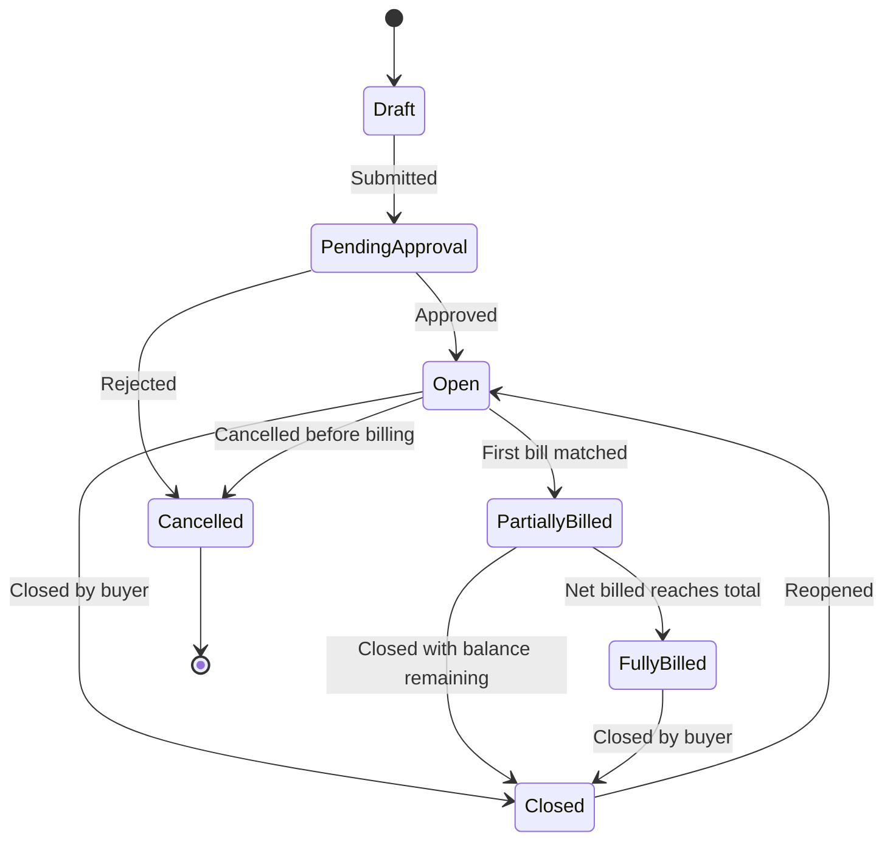

# Purchase order details

The purchase order details page is the record of what you agreed to buy, from whom, on what terms, and how much of it has been billed so far. Open it from the **Purchase orders** page, from the request that produced it, or from any invoice matched to it.

<figure></figure>

The page has two tabs. **Overview** holds the vendor, buyer and terms shown here. **Billing details** lists the invoices and bills that have been billed against the PO, along with any vendor credits applied to it.

## The summary panel

The left panel is fixed as you scroll. It leads with the PO number and the current status chip.

Under the number, a progress bar splits the PO total into what has been used and what is left.

| Field | What it shows |
| --- | --- |
| **Total** | The full committed amount of the PO, in the PO currency. |
| **Net billed** | The amount billed against the PO so far, net of any vendor credits applied to it. Expand it to see the contributing bills. |
| **Open** | The remaining balance available to bill. Total minus net billed. |
| **Description** | Free text carried over from the request, or entered by the buyer. |


**Net billed** is net, not gross. A credit memo matched to the PO reduces net billed and returns that amount to **Open**. See [Applying vendor credits](../vendor-credits/applying-vendor-credits.md).


### Request and requester

**Request** links back to the purchase request that produced the PO, shown as the request number and title. Select it to open the request, its approval chain, and the answers the requester gave on the intake form.

**Requester** is the person who raised that request. They are not necessarily the buyer or the PO manager, and they are not automatically an approver on bills billed against the PO.

POs created manually rather than from a request show no request link.

### Creation and version

**PO created** is the date the PO record was created in Zip.

**Sent status** tells you whether the PO has been delivered to the vendor. It reads **Not sent** until you send it, and shows the send date afterwards. A PO can be fully approved and synced to the ERP while still unsent.

**Version** shows the current version number and the date that version was created. Every amendment increments it. See [Sending and amending POs](sending-and-amending-pos.md).

### Classification

**Department**, **Location**, **Category** and **Subcategory** carry over from the request and drive downstream routing. Category and subcategory determine which coders and bill approvers Zip assigns, and they feed spend reporting.

A dash means the field was never set. On POs created before a field was added to your configuration, expect dashes rather than back-filled values.

## Vendor details

The vendor card shows the vendor name and logo, with **View vendor record** opening the full record in [Vendor Management](https://app.gitbook.com/s/VzFAfjeuJK2DKd9GcLgy/).

It lists the vendor billing address and the vendor contacts, each with a mail icon. Where a vendor has more contacts than fit, a **more contact** control expands the rest. Contacts matter here because they are who receives the PO when you send it, and who receives remittance if no dedicated remittance address is set.

**Edit mode** is a toggle in the corner of the card. Turn it on to change the address or contacts for this PO only. Turning it on does not change the vendor record itself.

## Buyer details

The buyer card holds your side of the transaction.

**Billing address** is where the vendor should send the invoice. It reads **No address added** when the subsidiary has no billing address configured.

**Ship to** is the delivery destination, usually the requester's name and their location address. For services and software, ship-to is often the same person as the requester with no physical delivery expected.

The buyer card has its own **Edit mode** toggle, independent of the vendor card.

## Purchase terms

Purchase terms are the commercial substance of the PO, and the fields most often checked during an invoice dispute.

| Field | Notes |
| --- | --- |
| **Currency** | The PO currency. Invoices matched to the PO must be in the same currency. |
| **Total amount** | The committed amount, shown with the currency code. |
| **Subsidiary** | The legal entity buying. Drives the ERP the PO syncs to and the payment funding account. |
| **Start date** | For term agreements, when the coverage period begins. |
| **End date** | When it ends. Used for renewal reminders and for amortization. |
| **Payment terms** | The agreed terms, for example Net 30. Invoices matched to the PO inherit them when the invoice does not state its own. |
| **Payment frequency** | For recurring commitments, how often the vendor invoices. |
| **Quote number** | The vendor's quote or order reference, useful when the vendor cites their own number on the invoice. |
| **Manager** | The person accountable for the PO. Often the approver on amendments. |
| **Custom PO fields** | Fields your administrator has added, numbered in the order they were configured. |

**Special instructions** sits below the terms with its own **Edit mode** toggle. Anything written here appears on the PO document the vendor receives, so use it for delivery notes, reference numbers the vendor must quote, or invoicing instructions.

Why a term field shows None entered

**None entered** means the field is available but was never filled, usually because the intake form did not ask for it. It is not an error. Start date, end date and payment frequency are commonly blank on one-off purchases and populated on subscriptions and services agreements.

A dash is used instead for fields that have no value and no configured default, such as an unused custom field.

## Purchase order statuses

The status chip beside the PO number is set by Zip based on approvals, billing and buyer action.

| Status | Meaning | What you can do |
| --- | --- | --- |
| **Draft** | The PO has been created but not issued. Not visible to the vendor and not synced to the ERP. | Edit freely, or delete it. |
| **Pending approval** | The PO is moving through an approval chain, either from the originating request or from an amendment. | Watch the chain. Nothing can be billed against it. |
| **Open** | The PO is issued and has remaining balance to bill. | Send it to the vendor, receive against it, match invoices to it. |
| **Partially billed** | Some of the PO total has been billed. Balance remains open. | Continue matching invoices. |
| **Fully billed** | Net billed equals the PO total. No open balance. | Amend to increase the total, or close it. |
| **Closed** | The buyer has closed the PO. No further billing. | Reopen it if your permissions allow. |
| **Cancelled** | The PO was cancelled before completion. Terminal. | Raise a new PO if the purchase is still needed. |

## Header actions

The header carries the actions available on the PO.

* **Send to vendor** delivers the branded PO document. It is the primary action while the PO is unsent.
* The download icon exports the PO document as a PDF, which is the same document the vendor sees.
* The overflow menu holds the less common actions: amend, close, cancel, and resend.

For what each of those does, see [Sending and amending POs](sending-and-amending-pos.md). For how a PO is created in the first place, see [Convert a request to a purchase order](https://app.gitbook.com/s/BMSPlYB6zBpUu9WDNW3q/purchase-orders/converting-a-request-to-a-po).
