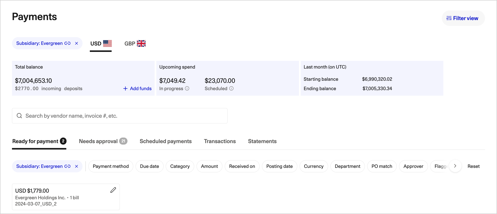

# Funding and payment methods

Zip pays vendors from clearing accounts you fund. Understanding how those accounts are topped up, and how Zip reads the balance against what is scheduled, is what keeps a payment run from failing on the send date.

## Clearing accounts

You hold a clearing account per currency. Payments in that currency are drawn from that account, and the balance for each is shown on its own currency tab on the **Payments** page.

<figure></figure>

Clearing accounts are yours. Zip does not net your payments against other customers' funds, and the **Statements** tab gives you a statement per account per currency for reconciliation.

## Funding by wire transfer

The standard model is a periodic wire transfer from your bank account into the Zip clearing account for that currency.



## Work out what the run needs

The **Schedule payouts** page shows **Funding needed for urgent bills**, which includes fees, alongside **Available balance for urgent bills**. **Upcoming spend** on the **Payments** page gives you the same view across everything scheduled.



## Get the funding instructions

**Add funds** on the balance card gives the account details and the reference to quote for that currency. Use the reference: an unreferenced wire takes longer to credit.



## Send the wire from your bank

Send it far enough ahead that it clears before the send date. Cross-border wires and wires sent late in the day can take longer than a domestic transfer.



## Watch it land

Funds in transit appear as incoming deposits under the total balance, and are added to the available balance when they credit.



Most teams fund on a weekly or twice-weekly rhythm matched to their payment runs, rather than per run.

## Direct debit for USD-funded accounts

For bank accounts funded in US dollars, you can configure direct debits from your organization's bank account to pay for vendor payouts instead of wiring in advance. Zip pulls the amount required for the run when the payments are due, so you do not carry a standing balance.

Direct debit needs a one-time authorization from your bank, set up by your administrator. Whether it is available depends on the account and its currency.

| | Wire funding | Direct debit |
| --- | --- | --- |
| **Currencies** | All supported currencies | USD-funded accounts |
| **Cash timing** | You pre-fund, so the balance sits with Zip until it is used | Funds are pulled when the payments are due |
| **Effort per run** | Someone initiates a wire | No per-run action once authorized |
| **Main risk** | An unfunded run on the send date | An authorization or bank-side block stopping the pull |


Whichever model you use, a scheduled payout that has no funds behind it on its send date does not go out. Check **Funding needed** against **Available balance** before the send date, not on it.


## Reading available balance against funding needed

Three numbers govern whether a run will succeed.

**Total balance** is what the account holds now, with funds in transit shown as incoming deposits beneath it.

**Available balance** is what can actually be drawn on. It excludes amounts already committed to approved payout groups, which is why it can be lower than the total balance even with nothing in transit.

**Funding needed** is what the scheduled payments require, including fees. When funding needed exceeds available balance, fund the gap or move bills to a later run.

The **Last month** card shows the starting and ending balance for the previous month on UTC, which is the figure to reconcile against your own ledger.

What happens if a payout is underfunded on its send date

Zip does not partially pay a payout group. The group is held rather than released, and AP is notified.

Fund the account and the group is released on the next processing cycle. Alternatively, remove bills from the group to bring it within the available balance and schedule the remainder separately.

Bills held this way accrue lateness against their due date, so if the shortfall will take days to fix, tell the affected vendors rather than letting them chase.

## Payment methods

The payment method is set on the vendor record and shown on the bill and on the payout group. Zip presents the methods available for the vendor's country and currency, and the vendor supplies the details during onboarding.

| Method | How it works | Typical use |
| --- | --- | --- |
| **ACH** | Domestic US bank transfer from the clearing account to the vendor's account. | The default for US vendors. Low cost, settles in a small number of business days. |
| **Local bank transfer** | The domestic scheme for the vendor's country, for example Faster Payments, SEPA or BACS equivalents. | Vendors paid in their own currency in their own country. |
| **International wire** | Cross-border transfer where no local scheme applies. | Vendors in countries without local rails, or paid in a currency other than their own. |
| **Virtual card** | A single-use card number issued to the vendor for a specific amount. | Vendors who accept cards, and purchases where card acceptance earns rebate or gives you an easier dispute path. |
| **Check** | A physical check issued and mailed on your behalf. | Vendors who will not or cannot accept electronic payment. |

Method availability depends on your configuration and the vendor's country. Not every method is enabled for every organization.

### Virtual cards

Virtual cards are part of the **Vendor Cards** add-on. A card is issued for the specific payment, with the amount and validity constrained to it, so an over-charge cannot be taken against it.

Use them where the vendor accepts cards and where you want the settlement speed of a card without giving out a corporate card number. The card transaction reconciles back to the bill in Zip in the same way a bank payment does.

### Choosing a method

The method is a property of the vendor, not of the individual bill, so it is set once during onboarding and reused. Changing it is a change to the vendor record and goes through the same verification as a bank detail change, because a payment method change is a common fraud vector. See [banking details and verification](https://app.gitbook.com/s/QStVF3i0EZksxOR4LHvB/vendor-submission/banking-details).


Fees vary by method, currency and corridor. Zip includes fees in the **Funding needed** figure on the payout group, so the number you fund to is the number that will be drawn. Your specific fee schedule comes from your agreement, not from this page.


## Failed and returned payments

A payment can fail after release: a closed account, incorrect bank details, a rejected direct debit, or a card the vendor could not process.

Failures appear on the **Transactions** tab with a reason. The bill returns to a payable state rather than being marked paid, so it is not lost. Correct the underlying problem, normally the vendor's bank details, before rescheduling. Rescheduling against the same bad details fails again and can incur a second fee.

Repeated failures on one vendor usually mean the vendor record is stale. Re-onboarding that vendor is the durable fix: see [Vendor Management](https://app.gitbook.com/s/VzFAfjeuJK2DKd9GcLgy/).
