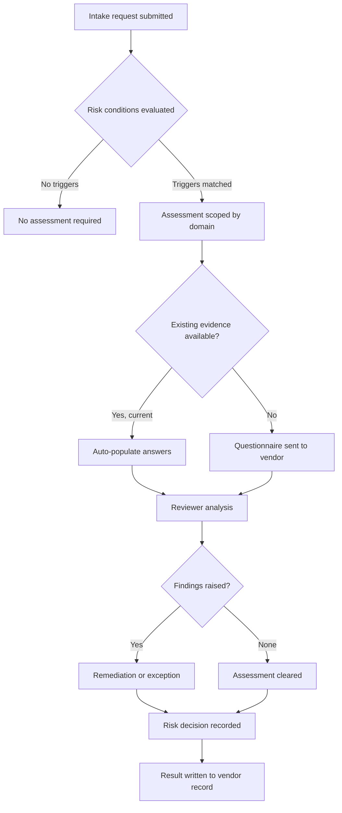

# How assessments are triggered

Assessments are triggered by conditions evaluated against request and vendor data. The requester answers business questions, and Zip works out which risk domains those answers implicate. Nobody has to know that a tool storing customer email addresses requires a privacy review.

## Trigger sources

**Intake answers.** The main source. Questions about data handling, system access, physical access, and criticality drive the domains that engage.

**Category.** Some categories always assess, for example anything in software or professional services with system access, regardless of how the requester answers.

**Value and criticality.** Spend thresholds, or a flag that the service supports a critical business process.

**Vendor state.** A new vendor, a vendor with no assessment on file, a vendor whose last assessment has expired, or a vendor with an open critical finding.

**Change events.** An expansion of scope on an existing vendor, a change in what data the vendor handles, or an incident reported against the vendor.

## The flow from request to decision

## Inherent risk screening

Before a full assessment is scoped, a short inherent risk screen runs. It asks a handful of questions about what the vendor will do and produces a preliminary tier.

The screen is what keeps the process proportionate. A vendor with no data access and no system connection does not need a full security questionnaire, and asking for one teaches your business that risk review is theatre.


Screening questions belong on the intake form, not in a separate step. The requester is already answering questions; adding four more there costs nothing, whereas a separate screening stage adds a handoff and a wait.


## Scoping

Scope determines which domains assess and how deeply. A vendor processing personal data engages privacy. A vendor connecting to internal systems engages security. A vendor critical to operations engages business continuity and financial health. Several domains commonly engage at once, and they run in parallel.

Depth varies within a domain. A low-tier security assessment may be satisfied by a current certification and a short questionnaire, while a high-tier one requires a full questionnaire, evidence review, and sometimes an interview.

## Running alongside approvals

The assessment is a step in the request's workflow, so its state is visible on the request. Requesters see that security review is in progress and what it is waiting on, rather than experiencing a silent delay.

Whether an approval can complete while an assessment is open is a policy choice. A common configuration lets a request proceed to contracting with an open assessment, but blocks purchase order issuance until the assessment clears or an exception is approved. For how these steps are configured, see [Workflow Engine](https://app.gitbook.com/s/cCva0sBd9z7KRG56Fq0I/).
