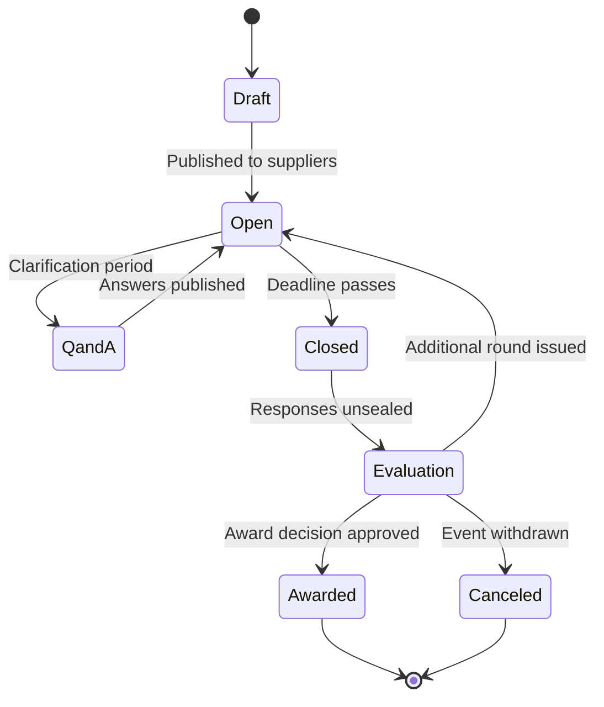

# Sourcing events

A sourcing event is a structured request sent to several suppliers at once, with a deadline, a defined question set, and a way to compare the answers. Zip supports three types. They differ in what you already know when you start.

## Event types

**Request for information (RFI).** You are exploring. You do not yet know who the credible suppliers are or what the solution should look like. An RFI collects capability, scale, and approach. It rarely collects binding pricing, and it usually ends by shortlisting suppliers for a later event rather than by awarding anything.

**Request for proposal (RFP).** You know the problem and want suppliers to propose a solution and a price. An RFP mixes narrative questions, requirements the supplier confirms it meets, and a pricing sheet. Scoring is weighted across several criteria because price is not the only thing being compared.

**Request for quotation (RFQ).** You know exactly what you want down to the specification, and you are comparing on price and terms. Questions are minimal, the pricing sheet is the substance, and awards often go to the lowest compliant bid.


An RFI can be converted into an RFP without rebuilding it. The shortlisted suppliers, the question set, and the attachments carry over, and you add the pricing sheet.


## Event lifecycle

**Draft.** You are building the event. Suppliers cannot see it.

**Open.** Suppliers have been invited and can respond. The submission deadline is running.

**Q and A.** Suppliers ask clarifying questions. Answers are published to all invited suppliers so no one gets an advantage, which is usually a compliance requirement rather than a courtesy.

**Closed.** The deadline has passed. No further responses are accepted unless an administrator reopens the event, which is logged.

**Evaluation.** Responses are unsealed and scored. You can issue an additional round to a shortlist, which returns those suppliers to **Open** with a new deadline.

**Awarded.** The award decision has been approved. The winning supplier is recorded on the event and can flow through to contracting and onboarding.

**Canceled.** The event was withdrawn without an award. Suppliers are notified.

## Sealed bids

Events can be run sealed. Responses are encrypted until the deadline passes, and no one on the buying side, including the event owner, can read a bid before then. Unsealing is recorded with the time and the person who did it. Use sealed bidding where policy or regulation requires demonstrable fairness.

## Who works on an event

The event owner runs it. Evaluators are the stakeholders who score responses, often from the requesting team, security, and finance. Evaluators see only the sections they are assigned to score, which keeps a technical reviewer from being anchored by price.
