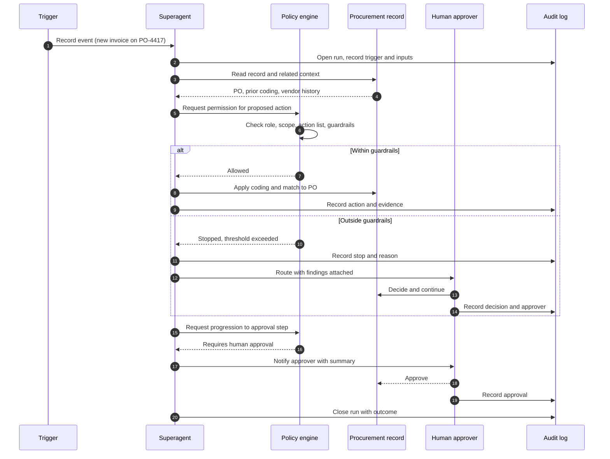

# Agent runs

A run is one complete pass by an agent over one record, from the trigger that woke it to the audit record it writes. Runs are the unit you monitor, replay, and export.

## The shape of a run

The policy check runs before the action, never after. An agent does not act and then seek forgiveness, because a reversal on a procurement record is not always possible once downstream systems have consumed it.

## What a run record contains

* The trigger: the event, the record, and the timestamp.
* The agent, its version, and the model and prompt version in use. See [Governed AI](https://app.gitbook.com/s/oovoef3hZyAQg9DepDDH/).
* Every record and document read, with the permission check result for each.
* The proposed action and the reasoning summary behind it.
* Every guardrail evaluated and its result, including the ones that passed.
* The action taken, or the stop and its reason.
* Any human decision, with the person, the timestamp, and what they changed.
* The final outcome and the run duration.

## Reviewing runs

Open **Superagents**, then **Runs**. Filter by agent, outcome, record type, or date. Each run opens as a timeline you can read top to bottom.


Start with stopped runs rather than completed ones. Stops tell you where your guardrails sit relative to reality. A run that completed as expected rarely teaches you anything.


Replaying a run

Select **Replay** on any run to re-evaluate it against the agent's current configuration. Replay reports what the agent would do now and where it would stop, without touching the record. Use replay to confirm the effect of a guardrail change before you apply it, and to check whether a past error is still reachable after a fix.

## Export

Runs export as structured records for your own analysis or for evidence. The export includes the full decision trail, not just the outcome. See the compliance evidence and audit export guidance in [Governed AI](https://app.gitbook.com/s/oovoef3hZyAQg9DepDDH/), and the programmatic access described in the [API reference](https://app.gitbook.com/s/CXK9J3Tjg4dEAgf0G90t/).
