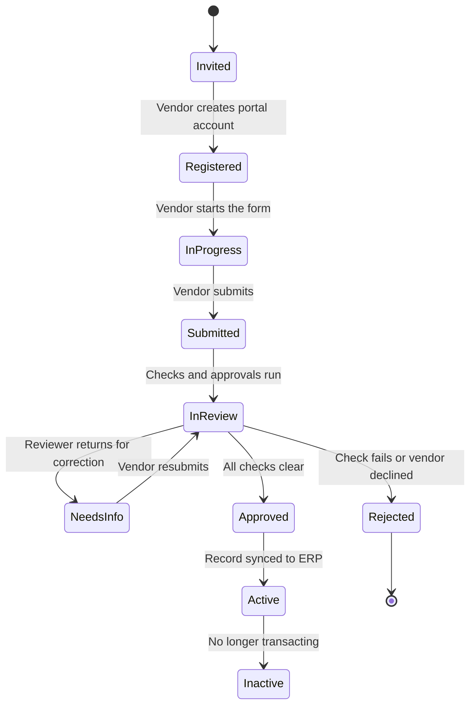

# Approve and activate a vendor

When a vendor submits its onboarding, Zip routes it for review. Review is not one person reading everything; it is the specific checks your policy requires, run in parallel by the teams that own them.

## Onboarding states

## What gets checked

**Data completeness.** Every required field and document is present and legible. Mostly automated.

**Tax validation.** The tax form matches the entity, and identifiers validate where a register is available. Owned by tax or AP.

**Bank verification.** The account is confirmed as the vendor's by one of the accepted methods. Owned by AP, and approved by a second person.

**Sanctions and watchlist screening.** The entity, and where required its beneficial owners, are screened against sanctions and denied party lists. A hit does not automatically reject; it routes to compliance for adjudication, since name matches are frequently coincidental.

**Duplicate check.** Zip matches the submission against existing vendors on tax ID, name, address, and bank account. See [Vendor Management](https://app.gitbook.com/s/VzFAfjeuJK2DKd9GcLgy/).

**Risk assessment.** For vendors whose category or data access warrants it, a security, privacy, or financial assessment runs alongside onboarding. See [Risk Orchestration](https://app.gitbook.com/s/yP3apwhDPTBLUNkrxs0C/).


Checks run in parallel. A security assessment that takes two weeks does not stop tax and banking review from completing, and the vendor can often be activated for purchasing while a lower-severity risk finding is still being remediated, if your policy allows it.


## Returning a submission

A reviewer who finds a problem returns the submission with a comment naming the field. The vendor sees exactly what to fix, corrects it in the portal, and resubmits. Only the returned sections are reopened; the rest stays as submitted.

Returning is better than correcting on the vendor's behalf. A field a reviewer typed is a field nobody at the vendor has attested to.

## Activation

When every required check clears, the vendor is approved and Zip creates the vendor record and syncs it to your ERP. On success the vendor moves to **Active**.

An active vendor can be selected on purchase requests, can be issued purchase orders, and can be paid. Until then it can be selected on a request but no PO can be issued against it.

Can we activate a vendor before onboarding is complete?

An administrator can grant a conditional activation with an expiry date, which is sometimes necessary for an urgent purchase. The vendor record carries the conditional flag, the outstanding items, and the expiry. If onboarding is not completed by the expiry, the vendor returns to inactive and payments are blocked. Use it rarely and review the list of conditional activations weekly.

What happens when a check fails outright?

Rejection ends the onboarding with a recorded reason. The requester and the internal owner are notified. Sanctions rejections are handled by compliance and the reason shown to the requester is deliberately limited.

