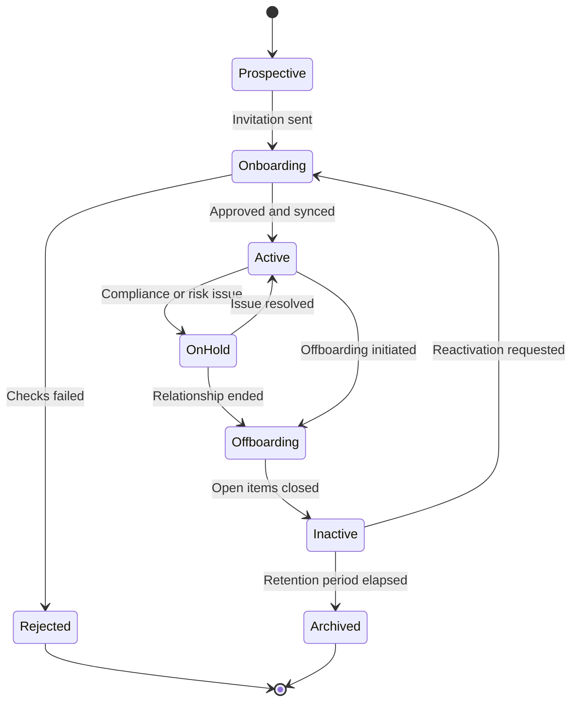

# Lifecycle states

A vendor's state controls what can be done with it: whether it can be selected on a request, whether a purchase order can be issued, and whether it can be paid. States are set by workflow, not edited directly, except where an administrator intervenes deliberately.

## What each state permits

**Prospective.** The vendor exists as a name, usually because it was invited to a sourcing event or named on a request. It can be selected on a request and evaluated in an event. No purchase order and no payment.

**Onboarding.** Onboarding is in progress. Same permissions as prospective. The state is visible on any request naming the vendor so the requester knows what is holding things up.

**Active.** Fully onboarded. Requests, purchase orders, invoices, and payments are all permitted. This is the only state in which money can leave.

**On hold.** Transacting is suspended while an issue is resolved: an unverified bank change, a sanctions hit, a critical risk finding, or a compliance concern. Existing purchase orders remain valid, but new POs and payments are blocked. The hold carries a reason and an owner.

**Offboarding.** The relationship is ending. New purchase orders are blocked while open POs, invoices, and contract obligations are worked through. See [Offboard a vendor](offboarding-a-vendor.md).

**Inactive.** No longer transacting. The record and its full history remain searchable and reportable. Reactivation is possible and routes back through onboarding to refresh anything expired.

**Rejected.** Onboarding did not clear its checks. Terminal, with the reason recorded.

**Archived.** Retained only for records retention after the retention period configured for your organization. Not selectable anywhere.


Do not use **On hold** as a soft offboarding. A hold is a temporary state with an owner and an expected resolution. A vendor left on hold for a year is a vendor nobody decided about, and it will surprise a requester at the worst moment.


## What changes state

State changes come from workflow: onboarding approval activates, a failed sanctions rescreen puts a vendor on hold, an offboarding request starts offboarding, and elapsed retention archives.

Administrators can change state manually. Manual changes require a reason and appear in the vendor's history and on the audit report, since manually activating a vendor bypasses the checks that activation normally represents.

## State and downstream records

State is evaluated when a record is created, not continuously against records already in flight. A purchase order issued while a vendor was active stays valid if the vendor later goes on hold, but a bill against that PO will not be paid while the hold stands. Zip flags open transactions whenever a vendor leaves **Active** so nothing sits unnoticed.
