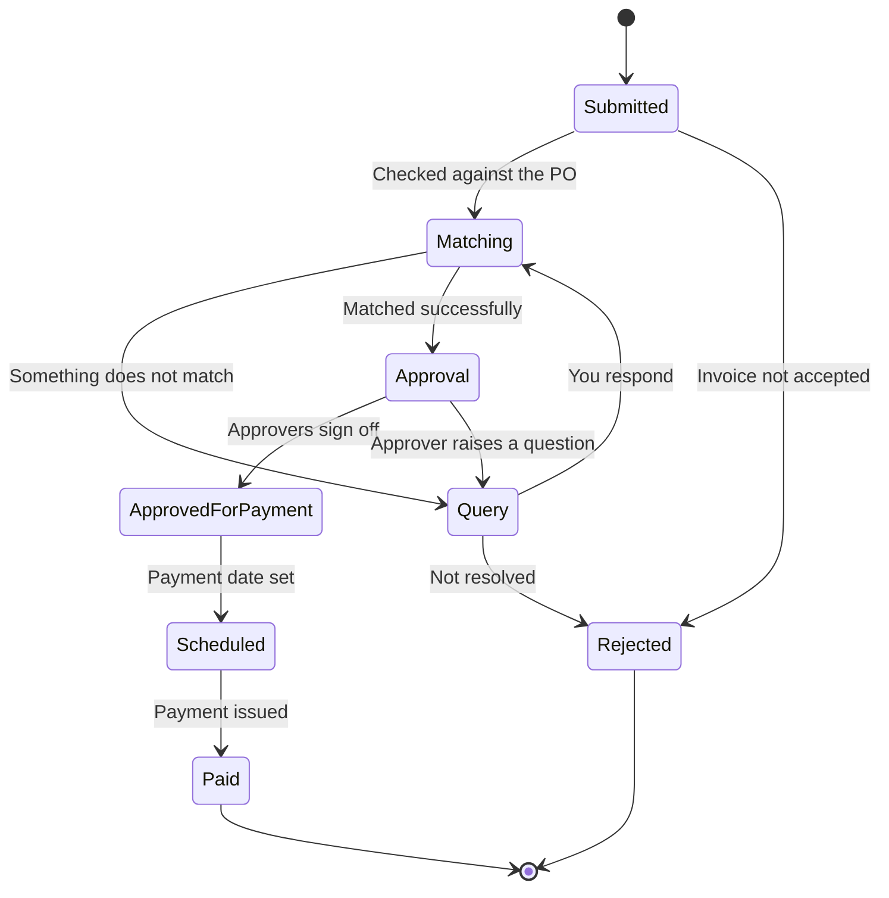

# Check payment status

Every invoice you submit has a status you can see yourself. You do not need to email anyone to ask where it is.

## From invoice to payment

## What each status means

**Submitted.** Your customer has received the invoice. Nothing is required from you.

**Matching.** The invoice is being checked against the purchase order and, where goods are involved, against what was received. Most invoices pass through quickly.

**Query.** Something needs resolving and your customer may need your response. Open the invoice to see the question and reply there. Invoices sitting in query are the ones that delay payment, so check this status first when a payment seems late.

**Approval.** The invoice matched and is with your customer's approvers. Timing depends on their internal process, not on anything you can do.

**Approved for payment.** Approved. It will be paid according to the agreed payment terms.

**Scheduled.** A payment date has been set. The date is shown on the invoice.

**Paid.** Payment has been issued. The payment record shows the method, the amount, and every invoice the payment covered.

**Rejected.** The invoice was not accepted. The reason is on the invoice. Correct the problem and submit a new invoice with a new number.


The scheduled date is when your customer issues the payment, not when it lands in your account. Bank transfers take time to settle, and the time depends on the method, the currency, and whether the payment crosses borders.


## Reading a payment

Open a payment from the **Payments** page to see the total, the date, the method, and the invoices it covers. Payments are commonly consolidated, so one transfer may settle several invoices, and the list is what you need to apply the cash correctly.

Any deductions are itemized: credit notes applied, withholding tax, or short payment against a disputed line. If a deduction is not explained on the payment, raise it with your customer.

## When a payment is late



## Check the invoice status

If it is in **Query**, the invoice is waiting on you. Answer the question.



## Check the payment terms

Terms run from the date a valid invoice was received. Confirm the date your invoice was actually accepted, not the date you issued it.



## Check your bank details

Open your company profile and confirm the account on file is correct and current. A payment sent to a closed account is returned and reissued, which adds time.



## Contact your customer

Comment on the invoice so the question stays attached to the record, or contact the buyer named on the purchase order.



Details you can maintain yourself, including where payments are sent, are covered in [Update banking details](../company-profile/updating-banking-details.md).
