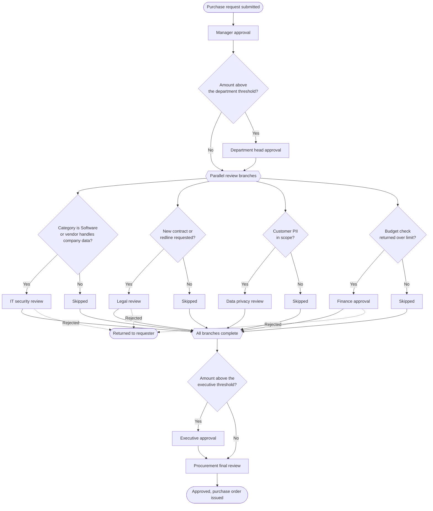

# Anatomy of a workflow

A workflow has four parts. Understanding the difference between them, particularly between a condition and a step, makes the builder straightforward.

## Trigger

The trigger is what starts the workflow. Most workflows are triggered by a record entering a state:

- A purchase request is submitted.
- A purchase request is materially changed after approval, which restarts affected steps.
- A bill is fully coded.
- A payout is scheduled above a threshold.
- A custom object is created or updated.

One record runs one workflow at a time. Which workflow is decided by routing, described in [Intake management](https://app.gitbook.com/s/klfPYPbO77zxOWiQGk7y/).

## Conditions

Conditions decide whether a step applies. They read fields on the record: category, amount, subsidiary, department, vendor risk tier, contract required, data types handled, and any custom field.

Conditions are evaluated when the chain is built and re-evaluated when the record changes. If someone raises the amount above a threshold after the chain started, the step that threshold gates is added.

## Actions

Actions are what a step does. Approval is the most common, but not the only one:

**Approval** assigns a decision to a person or group and waits for it.

**Review** assigns a task that must be completed but does not gate on approve or reject, such as attaching a document.

**Notification** informs someone without asking for anything.

**Field update** sets a value on the record, for example stamping a derived GL code.

**Integration call** creates or updates a record in a connected system, such as opening a ticket.

## Steps and the chain

A step binds a condition to an action and an assignee. The set of steps that pass their conditions, arranged in order, is the approval chain the record actually runs.

## A realistic workflow


The four review branches run at the same time, not in sequence. A skipped branch completes instantly, so a request needing no security, legal, or privacy review moves from department approval to procurement in one hop.


## Reading the chain on a record

Open any request and the chain is shown as a list of steps with their state: complete, active, pending, or skipped. Skipped steps stay visible with the reason they were skipped, which is usually the fastest way to answer "why did legal not see this?".

Next, see [Conditions and branching](conditions-and-branching.md) for how conditions are written, and [Approval steps](approval-steps.md) for how assignees are resolved.
